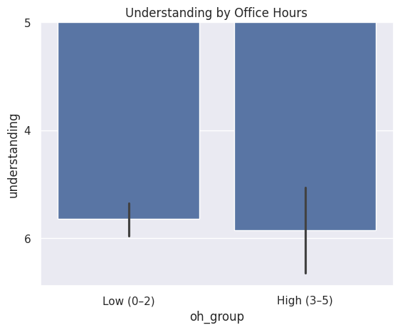
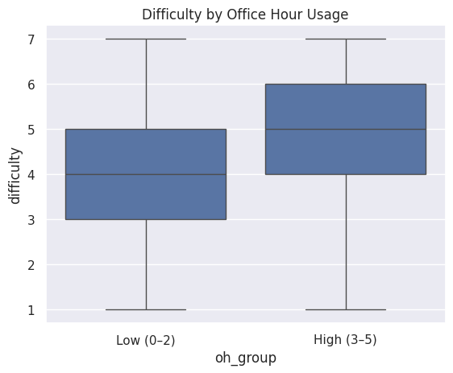
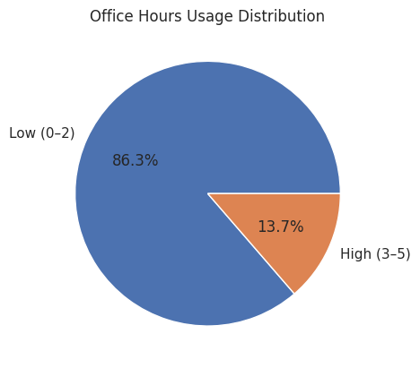

---
# Do not edit the text between these lines!
layout: default
---

<!-- This is a comment. Below, you'll see code for inserting an image. To make this image appear, update <custom-path>. To add an image, save it inside the imgs folder of this repository. -->
/static/imgs/logo.png" alt="Image of Comp110 rainbow logo. "  width="500"/>

# Office Hours and Student Learning Outcomes!!!!!!!!!!!!

## Project Summary

This project analyzes survey data to explore the relationship between office hours usage and student learning outcomes, including understanding and perceived difficulty.
Students were grouped into low (0–2 visits) and high (3–5 visits) office hours usage categories to compare differences in learning experiences.

## Visualizations

fhfhgg.. show up nowjfjfjfdn
fsjaka
sow u

### Understanding by Office Hours Usage
## Visualizations

### Understanding by Office Hours

### Difficulty by Office Hours

### Office Hours Usage

